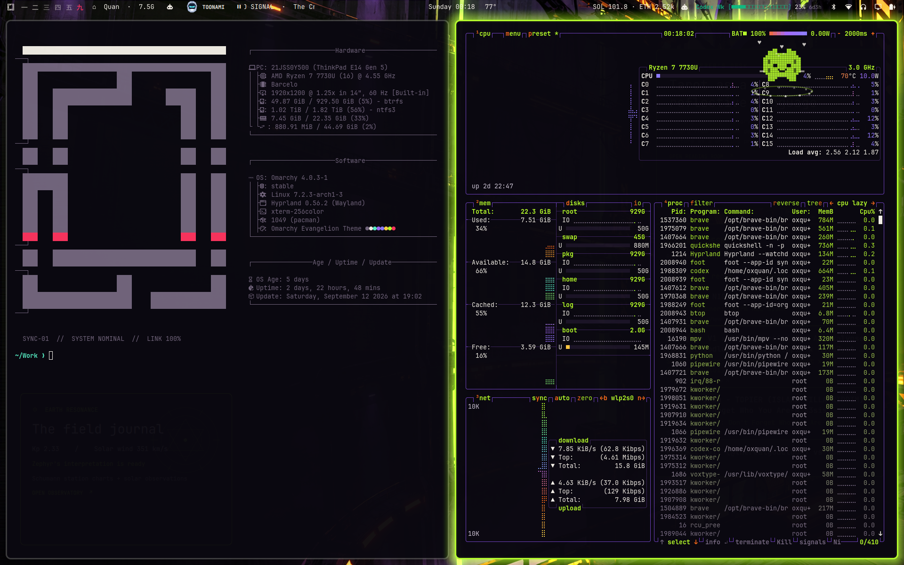
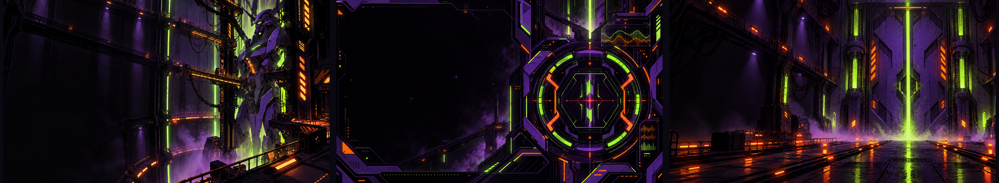

# SYNC-01: Evangelion-inspired Omarchy theme

A maximalist, fan-made Omarchy theme built from armored violet, toxic signal green,
electric warning orange, and near-black control-room surfaces.



The visual system takes cues from the industrial color blocking, chamfered hardware,
and dense amber telemetry of Evangelion-era command interfaces. Every bundled wallpaper
is original artwork created for this project. Official artwork, logos, screenshots, and
the HiBy reference renders are **not** redistributed.

## Install

```bash
omarchy theme install https://github.com/0xQuan93/omarchy-evangelion-theme.git
```

Omarchy applies a newly installed theme immediately. Later, select it again with:

```bash
omarchy theme set omarchy-evangelion-theme
```

Cycle the three 4K wallpapers with:

```bash
omarchy theme bg next
```

## Palette

| Role | Hex | Intent |
| --- | --- | --- |
| Signal | `#B7FF2A` | focus, success, active telemetry |
| Armor | `#6F42C1` | borders, structural framing |
| Ultraviolet | `#A56BFF` | secondary emphasis |
| Warning | `#FF6B1A` | urgent state and command accents |
| Alarm | `#FF345F` | errors and destructive actions |
| Terminal | `#0A0810` | main surface |
| Paper | `#F4F0E8` | readable warm foreground |

The palette deliberately reserves neon green for active state, orange for attention,
and red-pink for actual failure. This keeps the theme loud without flattening every
semantic state into the same glow.

## Included

- Complete Omarchy `colors.toml` palette, used to generate terminal and app themes.
- Custom `shell.toml`: three-stop violet→green→orange borders, translucent panels,
  orange countdowns, and distinct hover/focus/selection states.
- Three original 3840×2160 wallpapers with dark workspace-safe regions.
- A high-contrast `btop.theme` with green→orange→alarm graph ramps.
- Chromium frame color, Yaru purple icon selection, and green RGB keyboard hint.
- Preview and artwork provenance notes for a public repository.

## Wallpapers

1. **Cage 01** — a shadowed launch cage with its subject held to the right.
2. **Synchro Array** — abstract circular telemetry and a wide black work field.
3. **Terminal Gate** — a symmetrical blast-door corridor with wet orange runway light.



## Compatibility

Built for modern Omarchy themes driven by `colors.toml`. Git-installed themes are
intentionally data-only: Omarchy safely regenerates terminal integrations and ignores
executable theme files.

## Validate locally

```bash
python3 tests/validate_theme.py
```

## Fan-project notice

This is an unofficial fan work, not affiliated with or endorsed by khara, Gainax,
HiBy, or the Omarchy project. *Evangelion* and related names and marks belong to their
respective owners. See [ARTWORK.md](ARTWORK.md) and [LICENSE](LICENSE).
